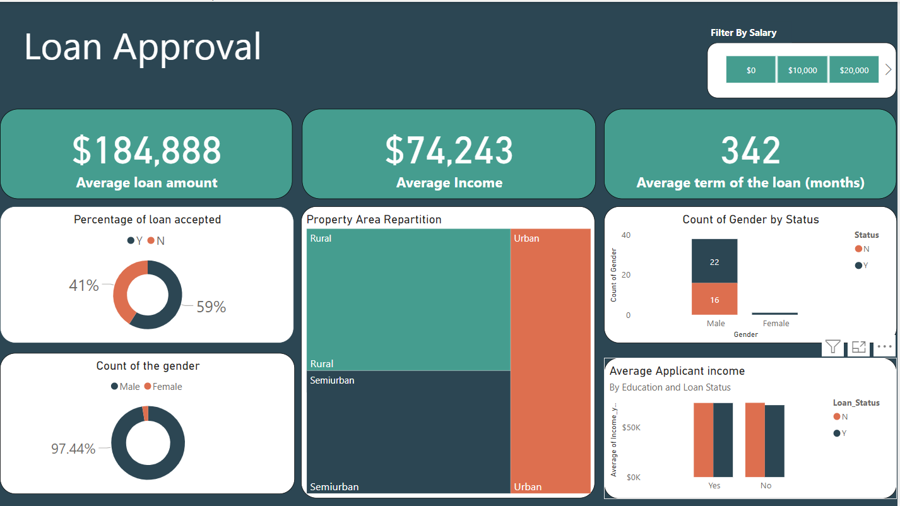

# Morgage_loan_dashboard: Project Overview
* Built a Power BI dashboard to track key metrics related to loan approval rates, including loan application volumes, approval rates, and loan amounts
* Created custom data visualizations in Power BI to help users quickly identify trends and patterns in the loan approval data
* Implemented data cleansing and data transformation techniques in Power Query to prepare data for analysis in Power BI
* Created calculated columns and measures in DAX to enable advanced calculations and aggregations in the Power BI dashboard
Designed interactive features in the Power BI dashboard, such as filters and slicer capabilities, to allow users to explore loan approval data at different levels of granularity

## Data and packages
* Data: https://www.kaggle.com/datasets/burak3ergun/loan-data-set
* Packages: Power Query, DAX
## Initial Features
       *'Loan_ID', 'Gender', 'Married', 'Dependents', 'Education',
       *'Self_Employed', 'ApplicantIncome', 'CoapplicantIncome', 'LoanAmount',
       *'Loan_Amount_Term', 'Credit_History', 'Property_Area', 'Loan_Status'
       
 ## Data Cleaning
 * Check for missing values
 * Check for the data types
 * Outliers removal
 
